# Project_2
Team members: Andy He, Shasha Li, Minglu Li, Ziwen Chen

## Usage

- Open a terminal window, and browse to the repo directory.

- Run `main.py` to excute the project by simply type following command in the terminal.

```
python main.py
```

## Part 1. Data Organize

The script `tools/data_prepare.py` extracts stock information from Yahoo Finance by specifying stock names in ticker and starting date. Output a DataFrame.

## Part 2. Extracting Technical Indicators

The script `tools/generate_indicators.py` extracts indicators from the original DataFrame and add those indicators as columns.

The technical indicators extracted includes following:

Simple Moving Average (SMA)
- SMA_s: short term SMA
- SMA_l: long term SMA
- SMA_ratio: ratio between the two

Simple Moving Average Volume (SMAV)
- SMAV_s: short term SMAV
- SMAV_l: long term SMAV
- SMAV_ratio: ratio between the two

Average True Range (ATR)
- ATR_s: short term ATR
- ATR_l: long term ATR
- ATR_ratio: ratio between the two

Average Directional Index (ADX)
- ADX_s: short term ADX
- ADX_l: long term ADX

Stochastic Oscillators (SO)
- Stochastic_PD_s: short term SO 
- Stochastic_PD_l: long term SO
- Stochastic_ratio: ratio between the two

Ralative Strength Index (RSI)
- RSI_s: short term RSI
- RSI_l: long term RSI
- RSI_ratio: ratio between the two

Moving Average Convergence Divergence (MACD)
- MACD: long term exponentially moving average - short term exponentially moving average

Bollinger Bands (BB)
- lowerband_s: short term SMA lower bound
- upperband_s: short term SMA upper bound
- lowerband_l: long term SMA lower bound
- upperband_l: long term SMA upper bound

Rate of Change (RC)

Awesome Oscillator (AO)

Chande Momentum Oscillator (CMO)

Kaufman Efficiency Indicator (ER)


## Part 3. Evaluate the indicators

We iterate through different window combinations of short window and long window for all indicators using decision tree classifier. The purpose is to search for the optimal window configuration according to the total strategy returns of all indicators.

- short window in range [2:14], with interval of 1
- long window in range [17:210], with interval of 7

According to our analysis, the best config is `short_window=9` and `long_window=70`.


Set the first 3 months of data as training and the rest for testing. The results for each indicator is shown in the figure below (The indicators with higher Strategy Return is considered as better ones: Stochastic Oscillators, RSI, CMO, BB, ADX, SMA, ER, RC):

Stochastic Oscillators (SO)

Strategy Return 2.65

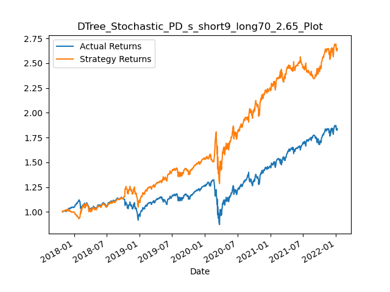

Ralative Strength Index (RSI)

Strategy Return 2.34

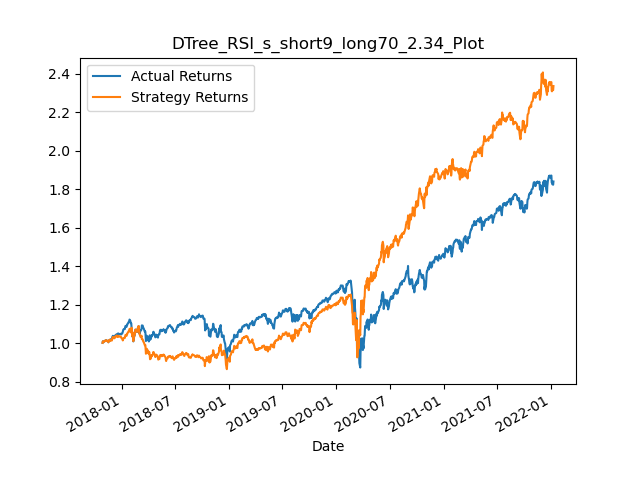

Chande Momentum Oscillator (CMO)

Strategy Return 2.14

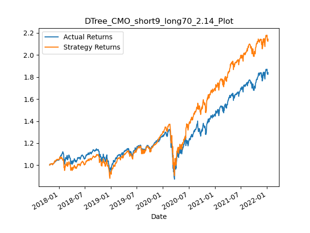

Bollinger Bands (BB)

Strategy Return 1.84

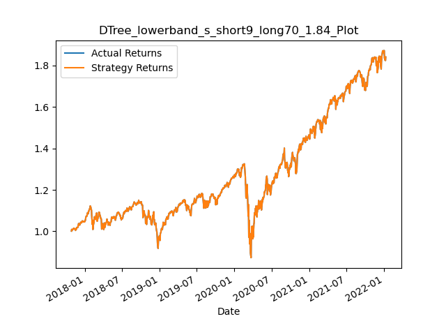

Average Directional Index (ADX)

Strategy Return 1.76

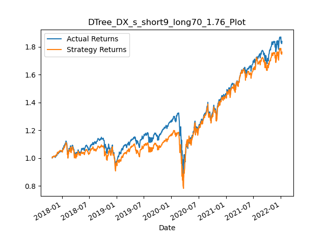

Simple Moving Average (SMA)

Strategy Return: 1.7

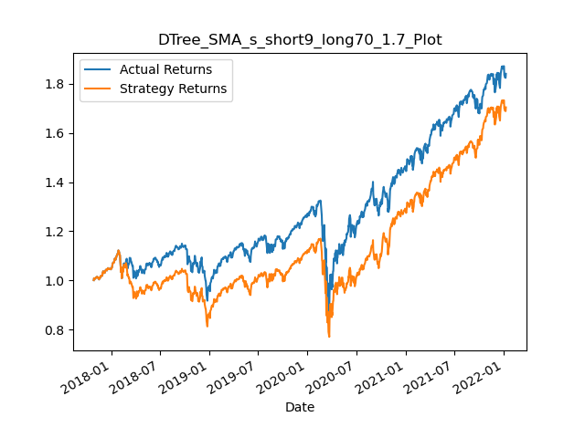

Kaufman Efficiency Indicator (ER)

Strategy Return 1.65

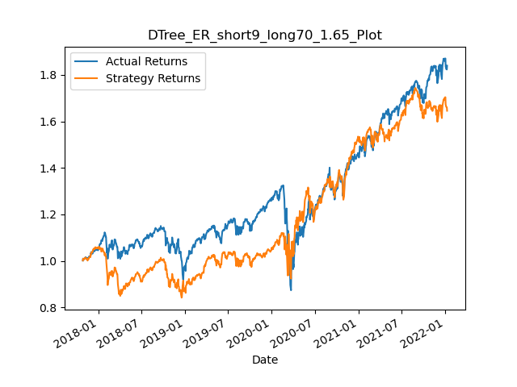

Rate of Change (RC)

Strategy Return 1.52

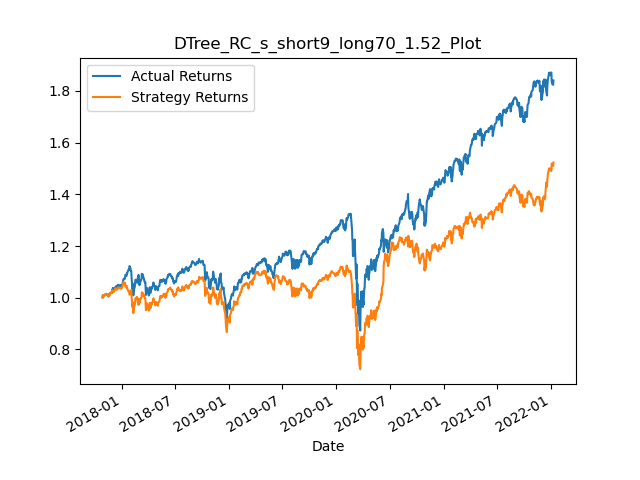

Awesome Oscillator (AO)

Strategy Return 1.42

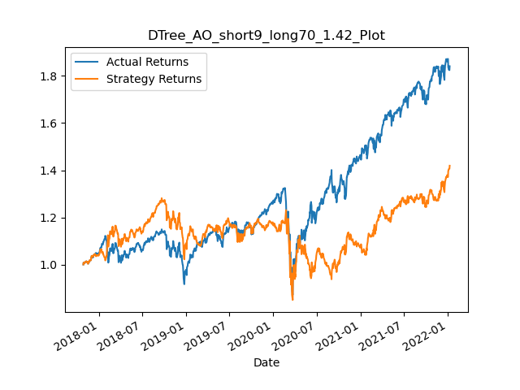

Simple Moving Average Volume (SMAV)

Strategy Return 1.41

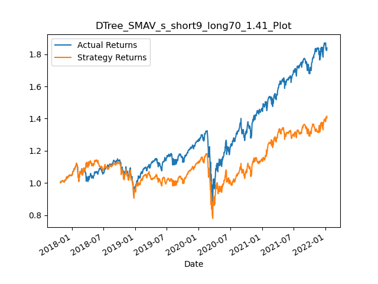

Average True Range (ATR)

Strategy Return 1.26

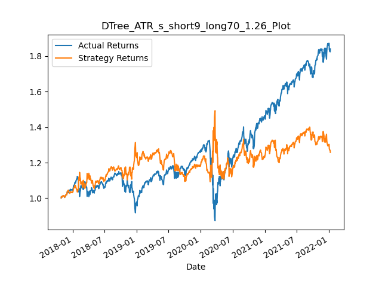

Moving Average Convergence Divergence (MACD)

Strategy Return 0.97

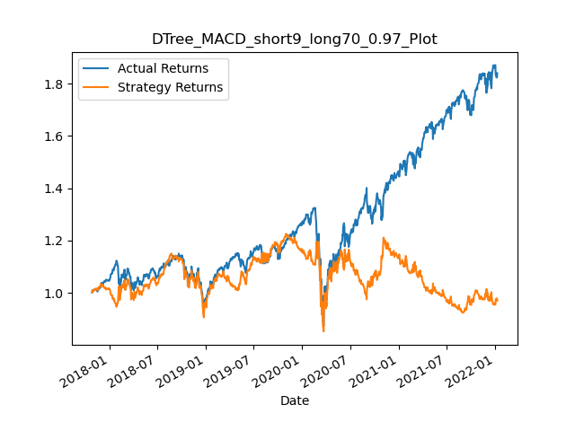
