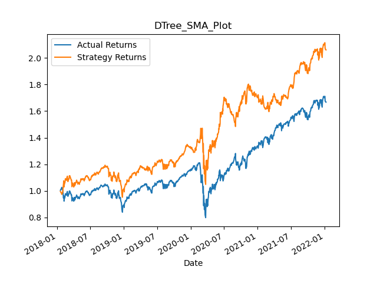
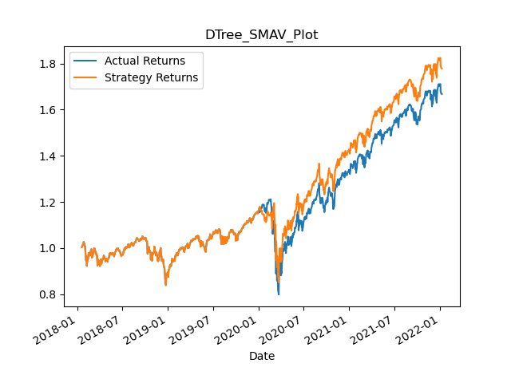
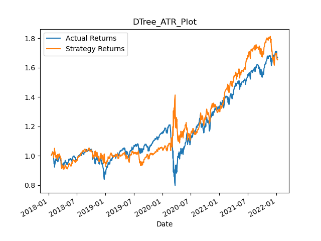
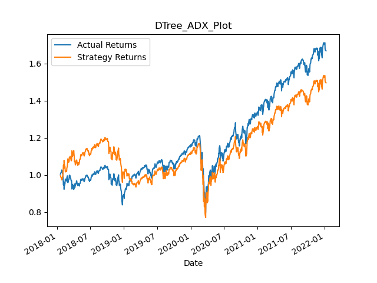
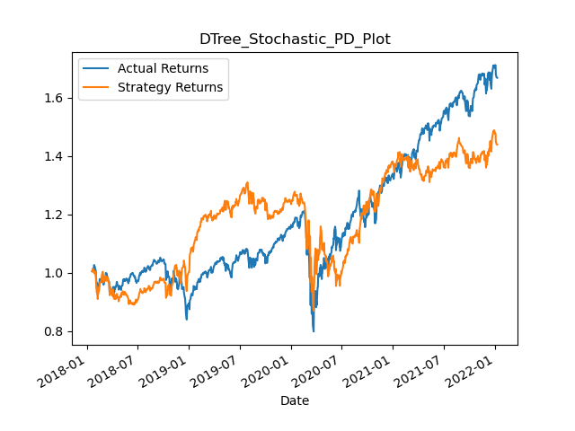
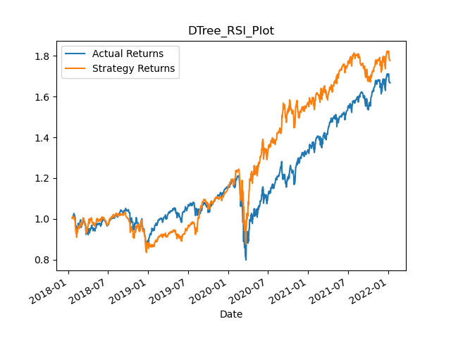
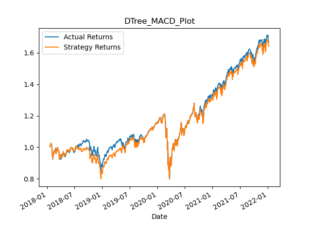
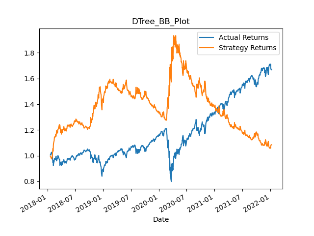
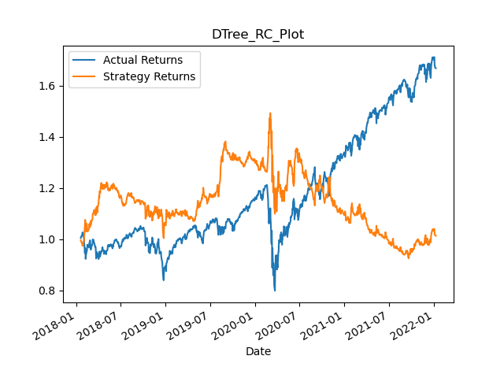

# Project_2
Team members: Andy He, Shasha Li, Minglu Li, Ziwen Chen

## Part 1. Data Organize

The script `tools/data_prepare.py` extracts stock information from Yahoo Finance by specifying stock names in ticker and starting date. Output a DataFrame.

## Part 2. Extracting Technical Indicators

The script `tools/generate_indicators.py` extracts indicators from the original DataFrame and add those indicators as columns.

The technical indicators extracted includes following:

Simple Moving Average (SMA)
- SMA_s: short term SMA
- SMA_l: long term SMA
- SMA_ratio: ratio between the two

Simple Moving Average Volume (SMAV)
- SMAV_s: short term SMAV
- SMAV_l: long term SMAV
- SMAV_ratio: ratio between the two

Average True Range (ATR)
- ATR_s: short term ATR
- ATR_l: long term ATR
- ATR_ratio: ratio between the two

Average Directional Index (ADX)
- ADX_s: short term ADX
- ADX_l: long term ADX

Stochastic Oscillators (SO)
- Stochastic_PD_s: short term SO 
- Stochastic_PD_l: long term SO
- Stochastic_ratio: ratio between the two

Ralative Strength Index (RSI)
- RSI_s: short term RSI
- RSI_l: long term RSI
- RSI_ratio: ratio between the two

Moving Average Convergence Divergence (MACD)
- MACD: long term exponentially moving average - short term exponentially moving average

Bollinger Bands (BB)
- lowerband_s: short term SMA lower bound
- upperband_s: short term SMA upper bound
- lowerband_l: long term SMA lower bound
- upperband_l: long term SMA upper bound

Rate of Change (RC)

## Generate Training Data

Run `main.py` to generate technical indicators for future training:

```
python main.py
```

Change following variables in `main.py` to change stock name, short-term window, and long-term window:

```
tickers = ['SPY']
short_window = 5
long_window = 15
```

## Evaluate the indicators

Set the following parameters for the indicators and used binary tree classification to evaluate the indicators.

```
short_window = 4
long_window = 100
```

Set the first 3 months of data as training and the rest for testing. The results for each indicator is shown in the figure below (The indicators with higher Strategy Return is considered as better ones):


Simple Moving Average (SMA)

Strategy Return: 2.08



Simple Moving Average Volume (SMAV)

Strategy Return 1.78



Average True Range (ATR)

Strategy Return 1.65



Average Directional Index (ADX)

Strategy Return 1.5



Stochastic Oscillators (SO)

Strategy Return 1.44



Ralative Strength Index (RSI)

Strategy Return 1.78



Moving Average Convergence Divergence (MACD)

Strategy Return 1.64



Bollinger Bands (BB)

Strategy Return 1.08



Rate of Change (RC)

Strategy Return 1.01


